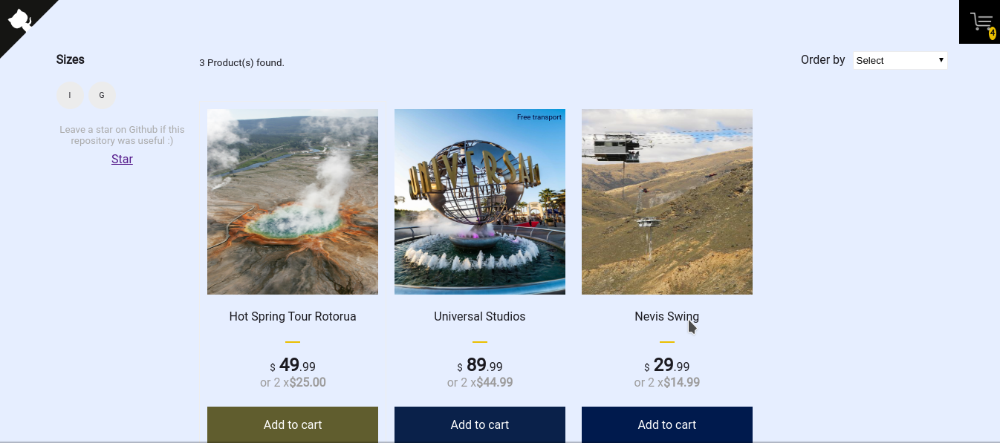
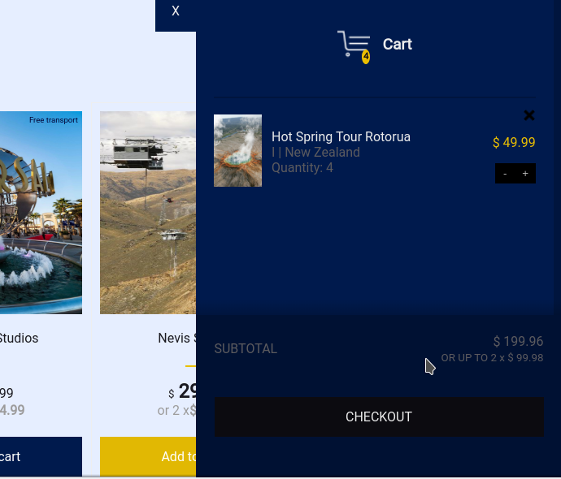
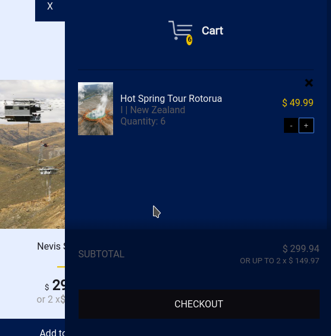
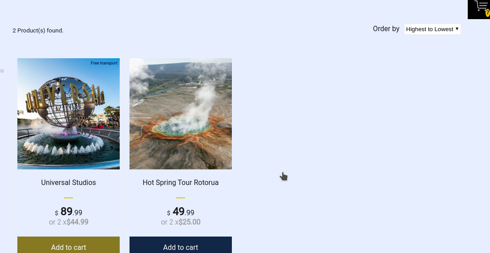
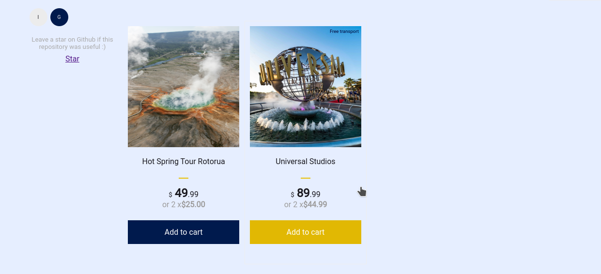

# Shopping-Cart

This is my thrid project with react!

The shopping cart project is an app that allows a user to purchase tickets for different attractions. 

## Example Use of the App
First opening of the app

Can checkout items by clicking on the cart logp

Add items to the cart before finalising checkout 

Can change the ordering of items by price(highest to lowest)

Can filter items by purchases available in groups or individuals

